# 100-days-of-swift

Solutions to Paul Hudson's "100 days of Swift" projects and challenges.

https://www.hackingwithswift.com/100

## Notes
- This is 100 days of **Swift**. For 100 days of **SwiftUI**, look [100-days-of-swiftui](https://github.com/fauzandwip/100-days-of-swiftui). 
- Reference the readme format of [clarknt](https://github.com/clarknt).

## Previews

*Within each project are larger versions of the screenshots.*

Projects / Topics  |  Screenshots
--- | ---
[Project 1](01_Project1) - __Storm Viewer__   View controllers, Storyboard,   FileManager | 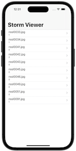 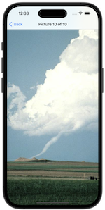 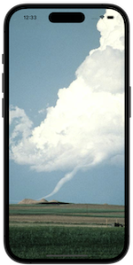 |
[Project 2](02_Project2) - __Guess The Flag__   UIButton, CALayer, IBAction  | 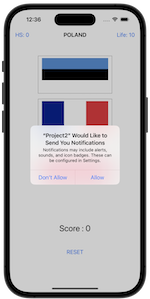 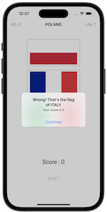 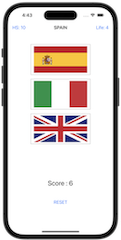 |
[Project 3](03_Project3) - __Social Media__   UIBarButtonItem, UIActivityController  |  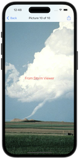 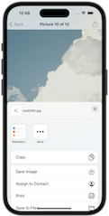 |
[Milestone Projects 1-3](04_Milestone-Projects1-3) -   __Country Flags__     | 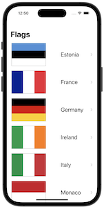  |
[Project 4](05_Project4) - __Easy Browser__   WKWebView, Action sheets,   UIToolbar, UIProgressView |  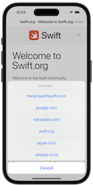 |
[Project 5](06_Project5) - __Word Scramble__   Reading from disk,   UIAlertController, IndexPath | 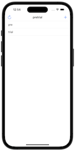 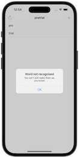 |
[Project 6](07_Project6) - __Auto Layout__   Auto Layout, Constraints,   Visual Format Language | 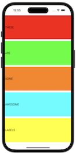 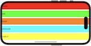 |
[Milestone Projects4-6 ](08_Milestone-Projects4-6) -   __Shopping List__     | 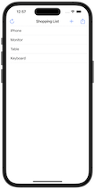 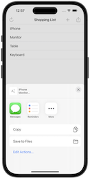 |
[Project 7](09_Project7) - __Whitehouse Petitions__   UITabBarController, JSON, Data, Codable  |   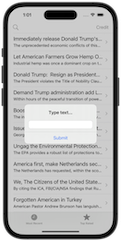 |
[Project 8](10_Project8) - __Swifty Words__   UI in code, Text alignment,   Layout Margins, UIFont | 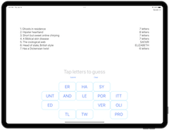 |
[Project 9](11_Project9) -   __Grand Central Dispatch__   Grand Central Dispatch, PerformSelector  |   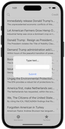 |
[Milestone Projects7-9](12_Milestone-Projects7-9) -   __Hangman__     | 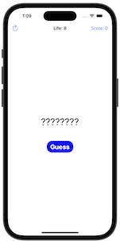 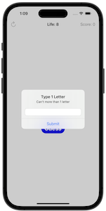 |
[Project 10](13_Project10) - __Names to Faces__   UIImagePickerController, NSObject  | 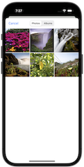 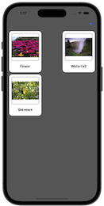 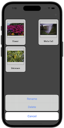 |
[Project 11](14_Project11) - __Pachinko__   SpriteKit, Nodes, UITouch, Physics Body,  SKAction, Collisions, Emitters | 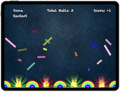 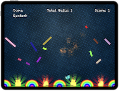 |
[Project 12](15_Project12) - __User Defaults__   UserDefaults, JSON, NSCoding, Codable  | 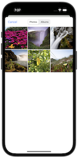 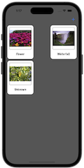 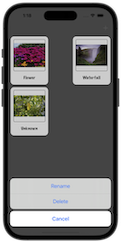 |
[Milestone Projects10-12](16_Milestone-Projects10-12) -   __Photo Captions__     | 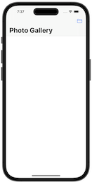  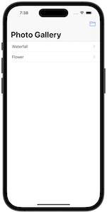 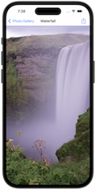 |
[Project 13](17_Project13) - __Instafilter__   UISlider, UIImagePickerController,  CIContext, CIFilter, Saving photos  | 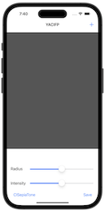 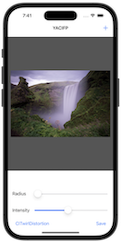 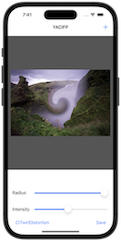 |
[Project 14](18_Project14) - __Whack-a-Penguin__   SKCropNode, SKTexture, SKAction  | 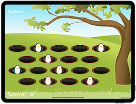 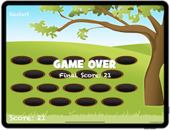 |
[Project 15](19_Project15) - __Animation__   Animation, CGAffineTransform  | 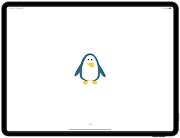 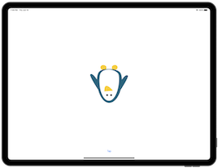 |
[Milestone Projects13-15](20_Milestone-Projects13-15) -   __Country Facts__     | 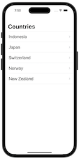 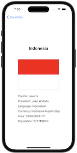 |
[Project 16](21_Project16) - __Capital Cities__   MapKit, MKMapView, MKAnnotation,   CLLocationCoordinate2D | 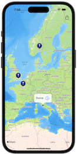 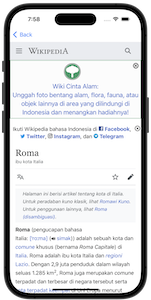 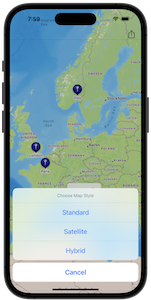 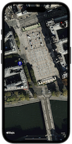|
[Project 17](22_Project17) - __Space Race__   Collisions, Timer,    Linear / Angular damping | 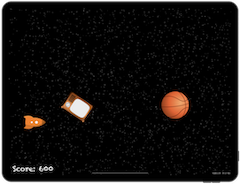 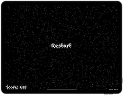 |
[Project 18](23_Project18) - __Debugging__   Debugging  | No Screenshot |
[Project 19](24_Project19) - __Safari Extension__   Safari Extensions, NSExtensionItem,   UITextView, NotificationCenter | 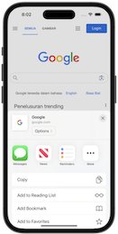 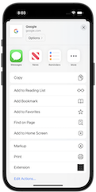 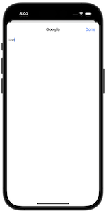 |
[Project 21](25_Project21) - __Local Notifications__   Notifications, UNUserNotificationCenter,    UNNotificationRequest |     |
[Milestone Projects19-21](26_Milestone-Projects19-21) -   __Notes__     |   |
[Project 24](27_Project24) - __Swift Strings__   Strings, NSAttributedString  | No Screenshot |
[Milestone Projects22-24](28_Milestone-Projects22-24) -   __Swift Extensions__   Extensions  | No Screenshot |
[Project 25](29_Project25) - __Chat Share__   Peer to Peer networking, MCSession,   MCBrowserViewController, MCPeerID  |     |
[Project 27](30_Project27) - __Core Graphics__   Core Graphics, UIGraphicsImageRenderer,    Fills and Strokes, Transforms |   |
[Milestone Projects25-27](31_Milestone-Projects25-27) -   __Meme Generator__     |    |
[Project 28](32_Project28) - __Secret Swift__   Biometrics authentication, Touch ID,   Face ID, iOS keychain |     |
[Project 30](33_Project30) - __Instruments__   Instruments, Time Profiler,   Allocations, Shadows, Table cells in code |   |
[Milestone Projects28-30](34_Milestone-Projects28-30_self) -   __Match Pairs__     |     |
