# 100-days-of-swift

Solutions to Paul Hudson's "100 days of Swift" projects and challenges.

https://www.hackingwithswift.com/100

## Notes

- This is 100 days of **Swift**. For 100 days of **SwiftUI**, look [100-days-of-swiftui](https://github.com/fauzandwip/100-days-of-swiftui).
- Reference the readme format of [clarknt](https://github.com/clarknt).

## Previews

_Within each project are larger versions of the screenshots._

| Projects / Topics                                                                                                                      | Screenshots                                                                                                                                                                                                                                                                                                 |
| -------------------------------------------------------------------------------------------------------------------------------------- | ----------------------------------------------------------------------------------------------------------------------------------------------------------------------------------------------------------------------------------------------------------------------------------------------------------- |
| [Project 1](01_Project1) - **Storm Viewer**   View controllers, Storyboard, FileManager                                 |  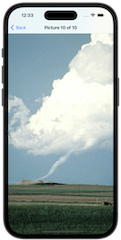                                                                                                                                         |
| [Project 2](02_Project1) - **Guess The Flag**   UIButton, CALayer, IBAction                                             |                                                                                                                                           |
| [Project 3](03_Project3) - **Social Media**   UIBarButtonItem, UIActivityController                                     | 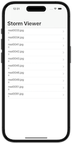                                                                                                                                          |
| [Milestone Projects 1-3](04_Milestone-Projects1-3) - **Country Flags**                                                  |                                                                                                                                                                       |
| [Project 4](05_Project4) - **Easy Browser**   WKWebView, Action sheets, UIToolbar, UIProgressView                       |                                                                                                                                                                                                 |
| [Project 5](06_Project5) - **Word Scramble**   Reading from disk, UIAlertController, IndexPath                          | 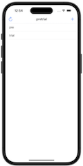                                                                                                                                                                                                |
| [Project 6](07_Project6) - **Auto Layout**   Auto Layout, Constraints, Visual Format Language                           |                                                                                                                                                                                                 |
| [Milestone Projects4-6 ](08_Milestone-Projecst4-6) - **Shopping List**                                                  |                                                                                                                                                                       |
| [Project 7](09_Project7) - **Whitehouse Petitions**   UITabBarController, JSON, Data, Codable                           |                                                                                                                                           |
| [Project 8](10_Project8) - **Swifty Words**   UI in code, Text alignment, Layout Margins, UIFont                        |                                                                                                                                                                                                                                                       |
| [Project 9](11_Project9) - **Grand Central Dispatch**   Grand Central Dispatch, PerformSelector                         |                                                                                                                                           |
| [Milestone Projects7-9](12_Milestone-Projects7-9) - **Hangman**                                                         | 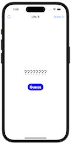                                                                                                                                                                      |
| [Project 10](13_Project10) - **Names to Faces**   UIImagePickerController, NSObject                                     |                                                                                                                                        |
| [Project 11](14_Project11) - **Pachinko**   SpriteKit, Nodes, UITouch, Physics Body, SKAction, Collisions, Emitters     |                                                                                                                                                                                               |
| [Project 12](15_Project12) - **User Defaults**   UserDefaults, JSON, NSCoding, Codable                                  |                                                                                                                                        |
| [Milestone Projects10-12](16_Milestone-Projects10-12) - **Photo Captions**                                              | 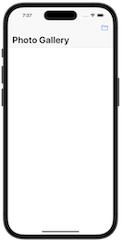                        |
| [Project 13](17_Project13) - **Instafilter**   UISlider, UIImagePickerController, CIContext, CIFilter, Saving photos    | 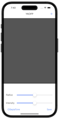                                                                                                                                       |
| [Project 14](18_Project14) - **Whack-a-Penguin**   SKCropNode, SKTexture, SKAction                                      |                                                                                                                                                                                               |
| [Project 15](19_Project15) - **Animation**   Animation, CGAffineTransform                                               |                                                                                                                                                                                               |
| [Milestone Projects13-15](20_Milestone-Projects13-15) - **Country Facts**                                               |                                                                                                                                                                   |
| [Project 16](21_Project16) - **Capital Cities**   MapKit, MKMapView, MKAnnotation, CLLocationCoordinate2D               |                                                                                 |
| [Project 17](22_Project17) - **Space Race**   Collisions, Timer, Linear / Angular damping                               |                                                                                                                                                                                               |
| [Project 18](23_Project18) - **Debugging**   Debugging                                                                  | No Screenshot                                                                                                                                                                                                                                                                                               |
| [Project 19](24_Project19) - **Safari Extension**   Safari Extensions, NSExtensionItem, UITextView, NotificationCenter  |   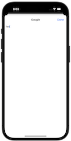                                                                                                                                     |
| [Project 21](25_Project21) - **Local Notifications**   Notifications, UNUserNotificationCenter, UNNotificationRequest   | 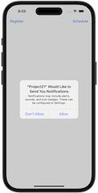  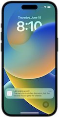                                                                              |
| [Milestone Projects19-21](26_Milestone-Projects19-21) - **Notes**                                                       | 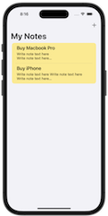 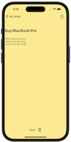                                                                                                                                                                 |
| [Project 24](27_Project24) - **Swift Strings**   Strings, NSAttributedString                                            | No Screenshot                                                                                                                                                                                                                                                                                               |
| [Milestone Projects22-24](28_Milestone-Projects22-24) - **Swift Extenstions**   Extensions                              | No Screenshot                                                                                                                                                                                                                                                                                               |
| [Project 25](29_Project25) - **Chat Share**   Peer to Peer networking, MCSession, MCBrowserViewController, MCPeerID     |                                                                                 |
| [Project 27](30_Project27) - **Core Graphics**   Core Graphics, UIGraphicsImageRenderer, Fills and Strokes, Transforms  | 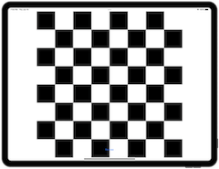                                                                                                                                                                                              |
| [Milestone Projects25-27](31_Milestone-Projects25-27) - **Meme Generator**                                              |   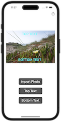                                                                                           |
| [Project 28](32_Project28) - **Secret Swift**   Biometrics authentication, Touch ID, Face ID, iOS keychain              |   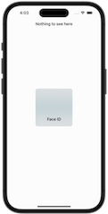                                                                              |
| [Project 30](33_Project30) - **Instruments**   Instruments, Time Profiler, Allocations, Shadows, Table cells in code    |                                                                                                                                                                                               |
| [Milestone Projects28-30](34_Milestone-Projects28-30_self) - **Match Pairs**                                            |     |
