# 100-days-of-swift

Solutions to Paul Hudson's "100 days of Swift" projects and challenges.

https://www.hackingwithswift.com/100

## Notes
- This is 100 days of **Swift**. For 100 days of **SwiftUI**, look [100-days-of-swiftui](https://github.com/fauzandwip/100-days-of-swiftui). 
- Reference the readme format of [clarknt](https://github.com/clarknt).

## Previews

*Within each project are larger versions of the screenshots.*
<!-- Projects / Topics | Screenshots
---|--- -->
<!-- | [Project 1 150](01_Project1) - __Storm Viewer__   View controllers, Storyboard, FileManager  |     |
| [Project 1 140](01_Project1) - __Storm Viewer__   View controllers, Storyboard, FileManager  |     |
| [Project 1 120](01_Project1) - __Storm Viewer__   View controllers, Storyboard, FileManager  |     | -->

Projects / Topics  |  Screenshots
--- | ---
| [Project 1 130](01_Project1) - __Storm Viewer__   View controllers, Storyboard, FileManager  |     |
| [Project 8 270](10_Project8) - __Swifty Words__   UI in code, Text alignment, Layout Margins, UIFont  |    |
<!-- | [Project 1](01_Project1) - __Storm Viewer__   View controllers, Storyboard, FileManager  |   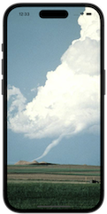 |
| [Project 2](02_Project1) - __Guess The Flag__   UIButton, CALayer, IBAction  | 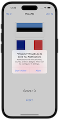 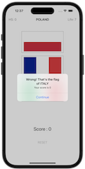  |
| [Project 3](03_Project3) - __Social Media__   UIBarButtonItem, UIActivityController  |    |
| [Milestone Projects 1-3](04_Milestone-Projects1-3) - __Country Flags__     |   |
| [Project 4](05_Project4) - __Easy Browser__   WKWebView, Action sheets, UIToolbar, UIProgressView  |   |
| [Project 5](06_Project5) - __Word Scramble__   Reading from disk, UIAlertController, IndexPath  |  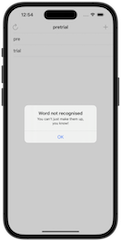 |
| [Project 6](07_Project6) - __Auto Layout__   Auto Layout, Constraints, Visual Format Language  | 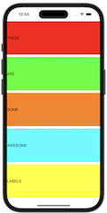 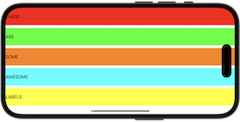 |
| [Milestone Projects4-6 ](08_Milestone-Projecst4-6) - __Shopping List__     |  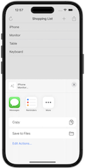 |
| [Project 7](09_Project7) - __Whitehouse Petitions__   UITabBarController, JSON, Data, Codable  |    |
| [Project 8](10_Project8) - __Swifty Words__   UI in code, Text alignment, Layout Margins, UIFont  |  |
| [Project 9](11_Project9) - __Grand Central Dispatch__   Grand Central Dispatch, PerformSelector  |    |
| [Milestone Projects7-9](12_Milestone-Projects7-9) - __Hangman__     |  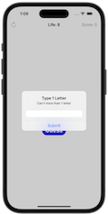 |
| [Project 10](13_Project10) - __Names to Faces__   UIImagePickerController, NSObject  |    |
| [Project 11](14_Project11) - __Pachinko__   SpriteKit, Nodes, UITouch, Physics Body, SKAction, Collisions, Emitters  |   |
| [Project 12](15_Project12) - __User Defaults__   UserDefaults, JSON, NSCoding, Codable  |    |
| [Milestone Projects10-12](16_Milestone-Projects10-12) - __Photo Captions__     |     |
| [Project 13](17_Project13) - __Instafilter__   UISlider, UIImagePickerController, CIContext, CIFilter, Saving photos  |    |
| [Project 14](18_Project14) - __Whack-a-Penguin__   SKCropNode, SKTexture, SKAction  |   |
| [Project 15](19_Project15) - __Animation__   Animation, CGAffineTransform  | 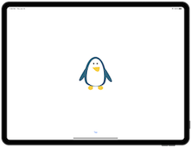 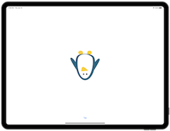 |
| [Milestone Projects13-15](20_Milestone-Projects13-15) - __Country Facts__     | 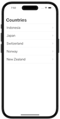 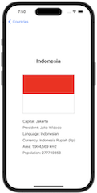 |
| [Project 16](21_Project16) - __Capital Cities__   MapKit, MKMapView, MKAnnotation, CLLocationCoordinate2D  | 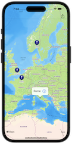 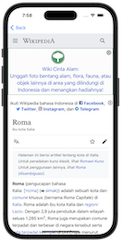 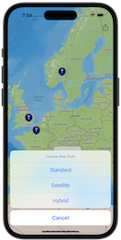 |
| [Project 17](22_Project17) - __Space Race__   Collisions, Timer, Linear / Angular damping  |   |
| [Project 18](23_Project18) - __Debugging__   Debugging  | No Screenshot |
| [Project 19](24_Project19) - __Safari Extension__   Safari Extensions, NSExtensionItem, UITextView, NotificationCenter |    |
| [Project 21](25_Project21) - __Local Notifications__   Notifications, UNUserNotificationCenter, UNNotificationRequest  |     |
| [Milestone Projects19-21](26_Milestone-Projects19-21) - __Notes__     |   |
| [Project 24](27_Project24) - __Swift Strings__   Strings, NSAttributedString  | No Screenshot |
| [Milestone Projects22-24](28_Milestone-Projects22-24) - __Swift Extenstions__   Extensions  | No Screenshot |
| [Project 25](29_Project25) - __Chat Share__   Peer to Peer networking, MCSession, MCBrowserViewController, MCPeerID  |     |
| [Project 27](30_Project27) - __Core Graphics__   Core Graphics, UIGraphicsImageRenderer, Fills and Strokes, Transforms  |   |
| [Milestone Projects25-27](31_Milestone-Projects25-27) - __Meme Generator__     | 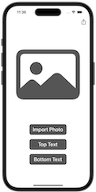   |
| [Project 28](32_Project28) - __Secret Swift__   Biometrics authentication, Touch ID, Face ID, iOS keychain  |  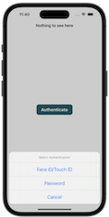  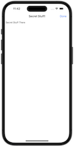 |
| [Project 30](33_Project30) - __Instruments__   Instruments, Time Profiler, Allocations, Shadows, Table cells in code  |   |
| [Milestone Projects28-30](34_Milestone-Projects28-30_self) - __Match Pairs__     |   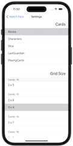  | -->
